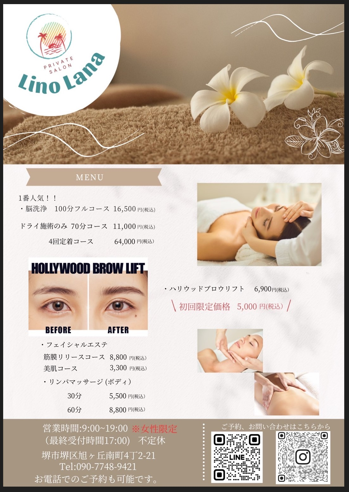
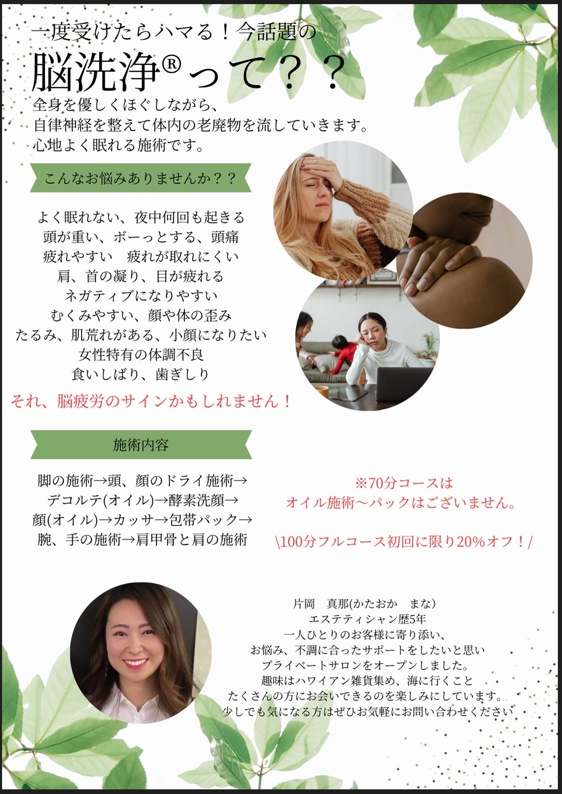

# LinoLana2.github.io
<!DOCTYPE html>
<html lang="en">

<head>
	<meta charset="utf-8" />
	<link rel="LinoLana" href="css/LinoLana.css">
	<meta name="google-site-verification" content="5TgQWfQpOKbte-rxvsJBnC6pryGQWToP8vqsGCdM7Wg" />

</head>

<body>
	
	
	
&nbsp;

	

	

	
	
	
	

&nbsp;

	

    

</body>
